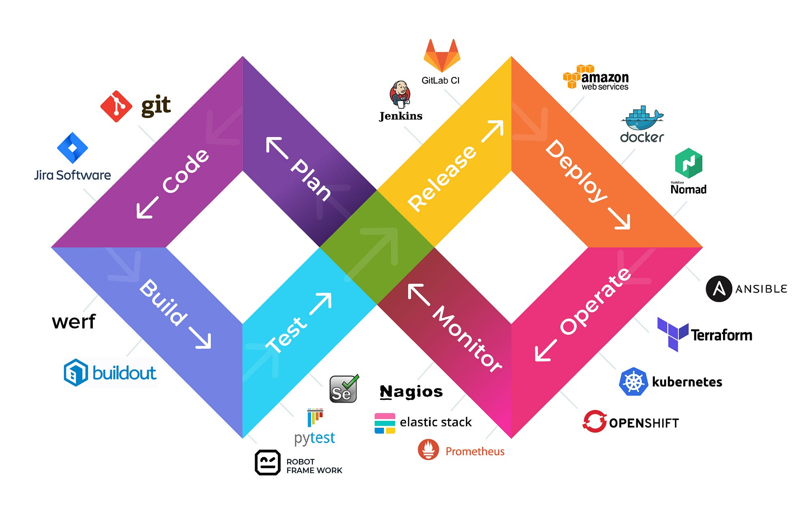

# DevOps และ DevSecOps: การพัฒนาและปฏิบัติการสำหรับระบบสารสนเทศยุคใหม่

บทที่ 1: พื้นฐานและวิวัฒนาการของ DevOps
-------------------

ในยุคดิจิทัล การพัฒนาซอฟต์แวร์ได้ก้าวผ่านยุค Waterfall ที่แบ่งการทำงานเป็นขั้นตอนชัดเจนและแยกส่วนระหว่างทีมพัฒนากับทีมปฏิบัติการ การทำงานในรูปแบบดังกล่าวมักนำไปสู่ปัญหาการสื่อสาร ความล่าช้าในการส่งมอบ และคุณภาพของซอฟต์แวร์ที่ไม่ตรงตามความคาดหวัง 

การเปลี่ยนผ่านสู่ยุค Agile เริ่มเห็นความสำคัญของการทำงานแบบยืดหยุ่นและการสื่อสารที่ใกล้ชิดมากขึ้น แต่ยังคงมีช่องว่างระหว่างทีมพัฒนาและทีมปฏิบัติการ DevOps จึงเกิดขึ้นเพื่อเชื่อมช่องว่างนี้ โดยมุ่งเน้นการทำงานร่วมกันอย่างไร้รอยต่อ การอัตโนมัติในทุกขั้นตอน และการส่งมอบคุณค่าอย่างต่อเนื่อง

การพัฒนาล่าสุดคือ DevSecOps ที่ผนวกความมั่นคงปลอดภัยเข้าไปในทุกขั้นตอนตั้งแต่เริ่มต้น แทนที่จะเป็นการตรวจสอบความปลอดภัยในขั้นตอนสุดท้าย แนวคิดนี้ตอบสนองต่อภัยคุกคามทางไซเบอร์ที่เพิ่มขึ้นและความต้องการระบบที่มีความปลอดภัยสูง

บทที่ 2: กระบวนการพัฒนาแบบ DevOps
-------------------

กระบวนการ DevOps เริ่มต้นจากการวางแผน (Plan) ที่ต้องอาศัยความร่วมมือระหว่างทีมธุรกิจ ทีมพัฒนา และทีมปฏิบัติการ การใช้ Jira Software ช่วยในการจัดการโครงการแบบ Agile โดยแบ่งงานเป็น User Stories ที่มีขนาดเหมาะสม กำหนด Sprint Backlog ที่ชัดเจน และติดตามความคืบหน้าได้แบบ real-time

การพัฒนา (Code) ในยุค DevOps ไม่ใช่แค่การเขียนโค้ดให้ทำงานได้ แต่ต้องคำนึงถึงการทำงานร่วมกันในทีมผ่าน Git การใช้ branching strategy ที่เหมาะสม เช่น GitFlow สำหรับโครงการขนาดใหญ่ หรือ trunk-based development สำหรับทีมที่ต้องการความเร็วในการส่งมอบ การทำ Code Review ผ่าน Pull Request ช่วยรักษาคุณภาพของโค้ดและกระจายความรู้ในทีม

การสร้าง (Build) ซอฟต์แวร์ต้องเป็นกระบวนการที่อัตโนมัติและสามารถทำซ้ำได้ เครื่องมืออย่าง Jenkins หรือ GitLab CI ช่วยในการสร้าง pipeline ที่ประกอบด้วยขั้นตอนต่างๆ เช่น การตรวจสอบคุณภาพโค้ด (code quality) การทดสอบอัตโนมัติ (automated testing) และการสร้าง container image การกำหนด build configuration ที่ดีช่วยให้กระบวนการ build มีประสิทธิภาพและใช้ทรัพยากรอย่างเหมาะสม

การทดสอบ (Test) ในกระบวนการ DevOps เป็นมากกว่าการทดสอบฟังก์ชันการทำงานพื้นฐาน จำเป็นต้องครอบคลุมหลายระดับ เริ่มจาก Unit Testing ที่ใช้ pytest หรือ JUnit เพื่อทดสอบส่วนประกอบย่อยของระบบ การทำ Integration Testing เพื่อทดสอบการทำงานร่วมกันระหว่างคอมโพเนนต์ และ End-to-End Testing ด้วย Robot Framework ที่จำลองการใช้งานจริงของผู้ใช้ การทดสอบทั้งหมดนี้ต้องทำงานอัตโนมัติและรายงานผลที่ชัดเจน เพื่อให้ทีมสามารถตรวจพบและแก้ไขปัญหาได้อย่างรวดเร็ว

การปล่อยรุ่น (Release) เป็นขั้นตอนที่ต้องการความรอบคอบและความเร็ว Jenkins และ GitLab CI ช่วยสร้าง deployment pipeline ที่อัตโนมัติ โดยรวมขั้นตอนต่างๆ ตั้งแต่การ build, test จนถึง deploy ไว้ด้วยกัน การใช้ feature flags ช่วยให้สามารถควบคุมการเปิดใช้งานฟีเจอร์ใหม่ได้อย่างยืดหยุ่น และการทำ canary deployment ช่วยลดความเสี่ยงจากการ deploy โดยค่อยๆ ปล่อยการอัพเดทให้ผู้ใช้บางส่วนก่อน

การติดตั้ง (Deploy) ในยุคปัจจุบันมักใช้ cloud platform อย่าง AWS, Azure หรือ GCP ร่วมกับ container orchestration อย่าง Kubernetes การใช้ Infrastructure as Code ด้วย Terraform ช่วยให้การจัดการโครงสร้างพื้นฐานเป็นระบบและสามารถทำซ้ำได้ การกำหนด deployment strategy ที่เหมาะสม เช่น blue-green deployment หรือ rolling update ช่วยให้การอัพเดทระบบมีผลกระทบต่อผู้ใช้น้อยที่สุด

การตรวจสอบ (Monitor) เป็นขั้นตอนที่สำคัญในการรักษาเสถียรภาพของระบบ Prometheus และ Grafana ช่วยในการเก็บและแสดงผลข้อมูลประสิทธิภาพของระบบ การตั้งค่า alerting ที่เหมาะสมช่วยให้ทีมสามารถตอบสนองต่อปัญหาได้ก่อนที่จะส่งผลกระทบต่อผู้ใช้ การวิเคราะห์ log ด้วย ELK Stack (Elasticsearch, Logstash, Kibana) ช่วยในการค้นหาสาเหตุของปัญหาและการวิเคราะห์แนวโน้ม

บทที่ 3: การยกระดับสู่ DevSecOps
-------------------

DevSecOps นำความมั่นคงปลอดภัยมาเป็นส่วนหนึ่งของทุกขั้นตอน เริ่มตั้งแต่การวางแผนที่ต้องมีการวิเคราะห์ความเสี่ยงและกำหนดมาตรการป้องกัน การพัฒนาต้องใช้ secure coding practices และมีการตรวจสอบ dependencies เพื่อป้องกันช่องโหว่ที่อาจมาจาก third-party libraries

ในขั้นตอนการ build และ test ต้องมีการใช้เครื่องมือ Static Application Security Testing (SAST) เพื่อตรวจหาช่องโหว่ในโค้ด และ Dynamic Application Security Testing (DAST) เพื่อทดสอบความปลอดภัยของระบบที่ทำงานจริง การ scan container images เพื่อตรวจหาช่องโหว่ที่อาจมีในระบบปฏิบัติการหรือ packages ต่างๆ

การ deploy ต้องมีการกำหนด security policies ที่เข้มงวด เช่น การจำกัดการเข้าถึงทรัพยากร การเข้ารหัสข้อมูล และการจัดการ secrets อย่างปลอดภัย การใช้ network segmentation และ security groups ช่วยจำกัดการเข้าถึงระหว่างส่วนประกอบต่างๆ ของระบบ

การตรวจสอบความปลอดภัยต้องทำอย่างต่อเนื่อง โดยใช้ระบบ Security Information and Event Management (SIEM) เพื่อเฝ้าระวังและตรวจจับภัยคุกคาม การทำ penetration testing อย่างสม่ำเสมอช่วยค้นหาช่องโหว่ที่อาจเกิดขึ้นใหม่ และการมี incident response plan ที่ชัดเจนช่วยให้ทีมสามารถรับมือกับเหตุการณ์ด้านความปลอดภัยได้อย่างมีประสิทธิภาพ

# การทบทวนบทที่ 4 และ 5 ของ DevOps และ DevSecOps

บทที่ 4: ทักษะและความรู้ที่จำเป็น
-------------------

ทักษะสำหรับนักพัฒนาในยุค DevOps ได้เปลี่ยนแปลงไปจากเดิมอย่างมาก นอกเหนือจากความเชี่ยวชาญในการเขียนโปรแกรม นักพัฒนาจำเป็นต้องเข้าใจการทำงานของระบบปฏิบัติการและเครือข่ายพื้นฐาน เพื่อให้สามารถออกแบบแอปพลิเคชันที่ทำงานได้อย่างมีประสิทธิภาพบนโครงสร้างพื้นฐานสมัยใหม่ ตัวอย่างเช่น การเข้าใจวิธีการจัดการหน่วยความจำและทรัพยากรของระบบ การออกแบบแอปพลิเคชันให้รองรับการทำงานแบบ distributed systems

ในด้านการใช้งาน Container และ Cloud Services นักพัฒนาต้องเข้าใจแนวคิดของ containerization และสามารถเขียน Dockerfile เพื่อสร้างสภาพแวดล้อมที่เหมาะสมสำหรับแอปพลิเคชัน รวมถึงการใช้งาน cloud services ต่างๆ เช่น การใช้ AWS S3 สำหรับจัดเก็บไฟล์ หรือ AWS RDS สำหรับฐานข้อมูล โดยคำนึงถึงประสิทธิภาพและค่าใช้จ่าย

การเขียน Infrastructure as Code เป็นทักษะที่สำคัญ นักพัฒนาต้องสามารถใช้เครื่องมืออย่าง Terraform หรือ AWS CloudFormation เพื่อกำหนดโครงสร้างพื้นฐานในรูปแบบโค้ด ซึ่งช่วยให้การสร้างและจัดการระบบเป็นไปอย่างอัตโนมัติและมีความสอดคล้องกันในทุกสภาพแวดล้อม

สำหรับวิศวกรระบบ การเรียนรู้การเขียนโปรแกรมและการใช้ Version Control เป็นสิ่งจำเป็น โดยเฉพาะภาษา Python หรือ Go ที่เหมาะสำหรับการเขียน automation scripts และเครื่องมือสำหรับการจัดการระบบ การใช้ Git ในการจัดการโค้ดและการทำงานร่วมกับทีมพัฒนา

การจัดการ Cloud Infrastructure เป็นทักษะหลักที่วิศวกรระบบต้องเชี่ยวชาญ ตั้งแต่การออกแบบสถาปัตยกรรมที่มีความยืดหยุ่นและขยายขนาดได้ การจัดการความปลอดภัยและการเข้าถึง การติดตั้งและดูแลรักษาระบบอัตโนมัติ รวมถึงการจัดการค่าใช้จ่ายให้มีประสิทธิภาพ

บทที่ 5: การนำไปใช้งานจริง
-------------------

การเริ่มต้นนำ DevOps มาใช้ในองค์กรควรเริ่มจากการประเมินสถานะปัจจุบันอย่างละเอียด โดยวิเคราะห์กระบวนการทำงานที่มีอยู่ เช่น ระยะเวลาในการพัฒนาและส่งมอบซอฟต์แวร์ จำนวนข้อผิดพลาดที่พบในการทำงาน ความถี่ในการ deploy ระบบ การประเมินทักษะของทีมงานในด้านต่างๆ เพื่อวางแผนการฝึกอบรมที่เหมาะสม

การวางแผนการเปลี่ยนแปลงควรกำหนดเป้าหมายที่ชัดเจนและวัดผลได้ เช่น ต้องการลดระยะเวลาในการ deploy จาก 1 สัปดาห์เหลือ 1 วัน หรือต้องการเพิ่มความถี่ในการ deploy จาก เดือนละครั้งเป็นสัปดาห์ละครั้ง การเลือกโครงการนำร่องที่มีขนาดเหมาะสม ไม่ใหญ่เกินไปจนยากต่อการจัดการ แต่มีความสำคัญพอที่จะแสดงให้เห็นประโยชน์ของการเปลี่ยนแปลง

ในการเลือกเครื่องมือ องค์กรควรพิจารณาปัจจัยต่างๆ อย่างรอบด้าน เช่น ความเข้ากันได้กับระบบที่มีอยู่ ความยากง่ายในการใช้งานและการดูแลรักษา ค่าใช้จ่ายทั้งในระยะสั้นและระยะยาว ความพร้อมของทีมงานในการเรียนรู้และใช้งาน ตัวอย่างเช่น หากทีมมีประสบการณ์กับ Jenkins อยู่แล้ว การเลือกใช้ Jenkins เป็น CI/CD tool อาจเหมาะสมกว่าการเปลี่ยนไปใช้เครื่องมือใหม่ที่ทีมไม่คุ้นเคย

การปรับปรุงกระบวนการควรทำอย่างค่อยเป็นค่อยไป เริ่มจากการปรับปรุงส่วนที่เป็นคอขวดหรือมีปัญหามากที่สุดก่อน เช่น หากพบว่าการ deploy ระบบใช้เวลานานและเกิดข้อผิดพลาดบ่อย อาจเริ่มจากการทำ deployment automation ก่อน แล้วค่อยขยายไปสู่การทำ continuous integration และ automated testing ในภายหลัง

การวัดผลและปรับปรุงอย่างต่อเนื่องเป็นสิ่งสำคัญ องค์กรควรกำหนดตัวชี้วัดที่สำคัญ เช่น Mean Time To Recovery (MTTR), Deployment Frequency, Change Lead Time และ Change Failure Rate เพื่อติดตามความก้าวหน้าและระบุจุดที่ต้องปรับปรุง การจัดประชุมทบทวนและแลกเปลี่ยนประสบการณ์ระหว่างทีมอย่างสม่ำเสมอจะช่วยให้เกิดการเรียนรู้และพัฒนาร่วมกัน

การสร้างวัฒนธรรมการทำงานแบบใหม่เป็นสิ่งที่ต้องให้ความสำคัญ โดยส่งเสริมการทำงานร่วมกันระหว่างทีม การแบ่งปันความรู้และประสบการณ์ การยอมรับความผิดพลาดและการเรียนรู้จากความผิดพลาด การให้ความสำคัญกับการทำงานอัตโนมัติและการวัดผล ผู้บริหารต้องแสดงให้เห็นถึงการสนับสนุนการเปลี่ยนแปลงอย่างชัดเจนและต่อเนื่อง

[ต่อเนื่องจากเนื้อหาก่อนหน้า]

บทที่ 6: การปรับเปลี่ยนองค์กรสู่ DevOps
-------------------

การเปลี่ยนแปลงสู่ DevOps ไม่ใช่เพียงการนำเครื่องมือใหม่มาใช้ แต่เป็นการเปลี่ยนแปลงวัฒนธรรมองค์กรอย่างลึกซึ้ง เริ่มจากการสร้างความเข้าใจร่วมกันระหว่างผู้บริหารและทีมงาน การกำหนดวิสัยทัศน์และเป้าหมายที่ชัดเจน และการวางแผนการเปลี่ยนแปลงที่เป็นขั้นตอน

การประเมินความพร้อมขององค์กรเป็นขั้นตอนสำคัญ โดยต้องพิจารณาทั้งด้านบุคลากร กระบวนการ และเทคโนโลยี การวิเคราะห์ value stream ช่วยให้เห็นจุดที่เป็นคอขวดและโอกาสในการปรับปรุง เช่น ระยะเวลาที่ใช้ในการ code review ที่นานเกินไป หรือกระบวนการ deployment ที่ซับซ้อนและเสี่ยงต่อข้อผิดพลาด

การพัฒนาทีมงานต้องทำอย่างต่อเนื่อง โดยเฉพาะการสร้าง T-shaped skills ที่ทำให้บุคลากรมีความเชี่ยวชาญลึกในด้านหนึ่ง และมีความรู้กว้างในด้านอื่นๆ การจัดทำแผนฝึกอบรมที่ครอบคลุมทั้งด้านเทคนิคและ soft skills การสร้างระบบ mentoring และการส่งเสริมการแบ่งปันความรู้ภายในองค์กร

บทที่ 7: การวัดผลและการปรับปรุงอย่างต่อเนื่อง
-------------------

การวัดผลความสำเร็จของ DevOps ต้องพิจารณาตัวชี้วัดที่สำคัญหลายด้าน เริ่มจาก Deployment Frequency ที่แสดงถึงความสามารถในการส่งมอบซอฟต์แวร์ Lead Time for Changes ที่วัดระยะเวลาตั้งแต่เริ่มพัฒนาจนถึงการ deploy Mean Time to Recovery (MTTR) ที่แสดงถึงความสามารถในการแก้ไขปัญหา และ Change Failure Rate ที่วัดความน่าเชื่อถือของการเปลี่ยนแปลง

การเก็บและวิเคราะห์ข้อมูลเหล่านี้ต้องทำอย่างเป็นระบบ โดยใช้เครื่องมือที่เหมาะสม เช่น การใช้ Application Performance Monitoring (APM) tools เพื่อติดตามประสิทธิภาพของระบบ การใช้ analytics platform เพื่อวิเคราะห์พฤติกรรมผู้ใช้ และการใช้ dashboard ที่แสดงตัวชี้วัดสำคัญแบบ real-time

การปรับปรุงกระบวนการต้องทำอย่างต่อเนื่องผ่าน retrospective meetings ที่จัดอย่างสม่ำเสมอ การรวบรวม feedback จากทีมงานและผู้ใช้ การทดลองแนวทางใหม่ๆ ผ่าน proof of concept และการแลกเปลี่ยนประสบการณ์กับชุมชน DevOps ภายนอกองค์กร

บทที่ 8: อนาคตของ DevOps และการเตรียมความพร้อม
-------------------

อนาคตของ DevOps จะเห็นการผสานเทคโนโลยีใหม่ๆ เช่น AI/ML เข้ามาช่วยในการตัดสินใจและการทำงานอัตโนมัติ การใช้ GitOps ที่ใช้ Git เป็นศูนย์กลางในการจัดการโครงสร้างพื้นฐาน และการพัฒนา Platform Engineering ที่ช่วยให้ทีมพัฒนาสามารถทำงานได้อย่างมีประสิทธิภาพมากขึ้น

องค์กรต้องเตรียมพร้อมสำหรับการเปลี่ยนแปลงเหล่านี้ โดยการส่งเสริมวัฒนธรรมการเรียนรู้อย่างต่อเนื่อง การลงทุนในเทคโนโลยีที่เหมาะสม และการพัฒนาบุคลากรให้มีทักษะที่จำเป็น การสร้างความยืดหยุ่นและความคล่องตัวในการปรับตัวจะเป็นกุญแจสำคัญสู่ความสำเร็จในยุคดิจิทัล

บทสรุป
-------------------

DevOps และ DevSecOps เป็นแนวทางที่เปลี่ยนแปลงวิธีการพัฒนาและส่งมอบซอฟต์แวร์อย่างมีนัยสำคัญ การนำมาใช้อย่างมีประสิทธิภาพไม่เพียงต้องการการเปลี่ยนแปลงด้านเทคโนโลยี แต่ยังต้องการการเปลี่ยนแปลงวัฒนธรรมองค์กรและวิธีการทำงาน ความสำเร็จขององค์กรในยุคดิจิทัลจะขึ้นอยู่กับความสามารถในการปรับตัวและนำแนวคิดเหล่านี้มาใช้อย่างเหมาะสม

ประเด็นสำคัญที่องค์กรต้องคำนึงถึงในการนำ DevOps และ DevSecOps มาใช้ ได้แก่ การสร้างวัฒนธรรมการทำงานร่วมกัน การพัฒนาทักษะของบุคลากรอย่างต่อเนื่อง การเลือกใช้เทคโนโลยีที่เหมาะสม และการวัดผลเพื่อการปรับปรุงอย่างต่อเนื่อง องค์กรที่สามารถบูรณาการแนวคิดเหล่านี้เข้ากับกระบวนการทำงานได้อย่างมีประสิทธิภาพจะมีความได้เปรียบในการแข่งขันและสามารถตอบสนองความต้องการของลูกค้าได้ดียิ่งขึ้น

- [เอกสารอ้างอิง](./อ้างอิง.md)
-------------------
- [ภาคผนวก A: กรณีศึกษาการนำ DevOps ไปใช้จริง](./appendixA.md)
- [ภาคผนวก B: การแก้ไขปัญหาที่พบบ่อยในการปรับใช้ DevOps](./appendixB.md)
- [ภาคผนวก C: เครื่องมือและเทคโนโลยีเฉพาะด้านใน DevOps](/appendixC.md)
- [ภาคผนวก D: แผนการดำเนินงานและการวัดผลที่เป็นรูปธรรม](appendixD.md)

---